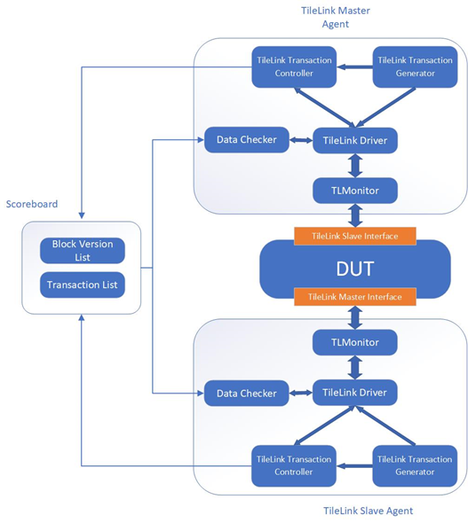

# 香山项目介绍导引

## 一、香山是什么

香山是一款开源的高性能 RISC-V 处理器，基于 Chisel 硬件设计语言实现，支持 RV64GC 指令集。在香山处理器的开发过程中，使用了包括 Chisel、Verilator、GTKwave 等在内的大量开源工具，实现了差分验证、仿真快照、RISC-V 检查点等处理器开发的基础工具，建立起了一套包含设计、实现、验证等在内的基于全开源工具的处理器敏捷开发流程。

**香山项目链接**：

- GitHub：[https://github.com/OpenXiangShan](https://github.com/OpenXiangShan)

- 码云：[https://gitee.com/OpenXiangShan](https://gitee.com/OpenXiangShan)


**香山项目仓库介绍**：

[**XiangShan**](https://github.com/OpenXiangShan/XiangShan)：香山处理器实现

[**XiangShan-doc**](https://github.com/OpenXiangShan/XiangShan-doc)：香山处理器文档，包括设计文档、公开报告以及对错误新闻的澄清

[**NEMU**](https://github.com/OpenXiangShan/NEMU/tree/master)：一个效率接近 QEMU 的高性能 ISA 解释器，这里有一个[介绍视频](https://www.bilibili.com/video/BV1Zb4y1k7RJ)

[**nexus-am**](https://github.com/OpenXiangShan/nexus-am)：Abstract Machine，提供程序的运行时环境，这里有一个[简单的介绍](https://nju-projectn.github.io/ics-pa-gitbook/ics2020/2.3.html)

[**DRAMsim3**](https://github.com/OpenXiangShan/DRAMsim3)：cycle-level 地模拟内存的行为

[**env-scripts**](https://github.com/OpenXiangShan/env-scripts)：一些脚本文件，包括性能分析、模块替换和时序分析等

以及其他仓库包括 **riscv-linux** ，**riscv-pk** ，**riscv-torture** 等等。

## 二、香山处理器目录结构

```
.
├── debug                # 一些跑测试的常用命令，写成了脚本的形式
├── scripts              # 生成 Verilog 及仿真使用的一些脚本
├── src                  # 结构设计与验证代码
│   ├── main               # 结构设计代码
│   │   └── scala
│   │       ├── bus            # 一些总线工具
│   │       ├── device         # 仿真用的一些外设
│   │       ├── difftest       # 差分测试接口描述
│   │       ├── system         # SoC 的描述
│   │       ├── top            # 顶层文件
│   │       ├── utils          # 一些基础硬件工具库
│   │       ├── xiangshan      # 香山 CPU 部分的设计代码
│   │       └── xstransforms   # 一些 FIRRTL Transforms
│   └── test               # 验证代码
│       ├── csrc             # 仿真用 C/C++ 代码
│       │   ├── common         # 仿真时的通用组件
│       │   ├── difftest       # 差分测试的 C/C++ 接口实现
│       │   ├── vcs            # VCS 仿真时使用的文件
│       │   └── verilator      # Verilator 仿真时使用的文件
│       ├── scala            # 基于 ChiselTest 实现的一些单元测试
│       │   ├── cache          # Cache 单元测试
│       │   ├── top
│       │   └── xiangshan      # 香山核内部模块单元测试
│       ├── testcase
│       │   ├── Makefile
│       │   └── tests
│       └── vsrc             # 仿真用 Verilog 代码
│           ├── common
│           └── vcs
├── ready-to-run         # 预先编译好的 nemu 动态链接库，和一些负载
├── rocket-chip          # 用来获取 Diplomacy 框架（等待上游拆分）
├── berkeley-hardfloat   # 修改后的 hardfloat，目前作为香山的 FPU 使用
├── block-inclusivecache # 修改后的 SiFive InclusiveCache，目前作为香山的 L2 及 L3 使用
└── chiseltest           # ChiselTest 框架源码
```

## 三、香山处理器架构设计

香山处理器是乱序六发射结构设计，前端包括取指单元、分支预测单元、指令缓冲等单元，顺序取指。后端包括译码、重命名、重定序缓冲、保留站、整型/浮点寄存器堆、整型/浮点运算单元。我们将访存子系统分离开，包括两条 load 流水线和两条 store 流水线，以及独立的 load 队列和 store 队列，Store Buffer等。缓存包括I\$、D\$、L1+\$、L2\$、TLB和预取器等模块。各部分的在流水线中的位置以及参数配置可以从下图中获得。


香山处理器的具体结构设计见后续介绍

## 四、单元测试

我们基于 ChiselTest 实现了 Agent-Faker Cache 测试框架，其设计思路类似于 UVM，目前应用于 Dcache、L2Cache 和 TLB。



## 五、仿真测试

香山处理器主要使用 verilator 进行仿真，并模拟 uart 和 sd 卡等外设。仿真时和模拟器 NEMU 做运行时对比，并将处理器的时钟中断等信息传递给模拟器，指导模拟器在关键选择上和处理器保持一致，提高仿真的灵活度。


当处理器和模拟器行为不一致时，仿真程序将会停止，通过查看波形和日志的方式进行错误分析。我们开发了 Wave Terminator，将低层次语义的波形提取成具有高层次语义的日志。另外，我们还开发了日志查看器 [LogViewer](https://github.com/OpenXiangShan/env-scripts/tree/main/logviewer)，从而更方便的查看日志。

## 六、性能评估

在仿真时，每个模块都可以自由地打印计数器，可以选择实时打印计数器以及在仿真结束时打印计数器。通过[脚本工具](https://github.com/OpenXiangShan/env-scripts/blob/main/perf/perf.py)对性能计数器进行分析，我们还开发了可视化工具对性能计数器进行分析。

为了测试 SPEC 基准测试的性能，以及对 SPEC 程序进行性能分析，使用 NEMU 生成 SPEC 程序的 SimPoint，进行大规模的并行测试，快速得出 SPEC 分数。另外，SPEC 片段也可以用于开发时的性能评估。
