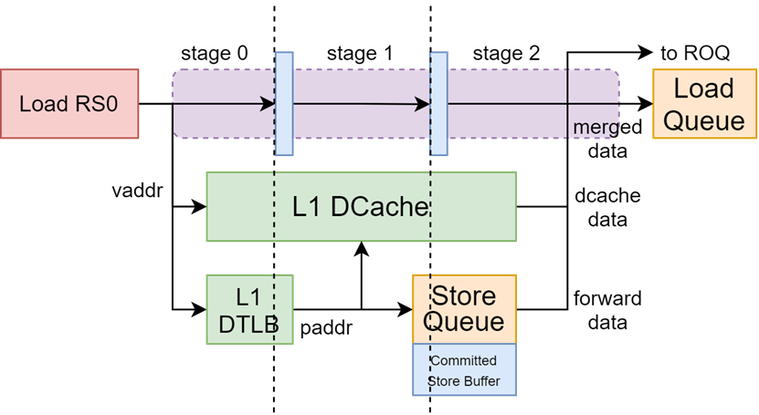

香山 load 流水线设计
===========

香山处理器(雁栖湖架构)包含两条 load 流水线, 每条 load 流水线分成3个流水级:

  

各级流水线的划分如下:

Stage 0
* 计算虚拟地址
* 虚拟地址送入 TLB
* 虚拟地址送入一级数据缓存

Stage 1
* TLB 产生物理地址
* 物理地址送进数据缓存
* 物理地址送进 store queue 开始进行 store 到 load 的前递操作
* 根据一级数据缓存返回的命中向量准备唤醒后续指令

Stage 2
* 根据一级数据缓存及前递返回的结果选择数据
* 更新 load queue 中的对应项
* 结果 (整数) 写回到公共数据总线
* 结果 (浮点) 送到浮点模块

