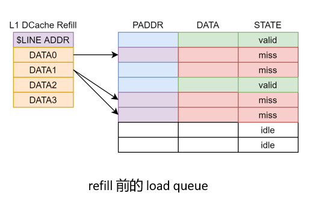

访存相关机制介绍
===========

# DCache Miss

如果 load miss, 在 load queue 中侦听 L1 DCache refill 结果:

  

  

一次 refill 会将数据传递到所有等待这一 cacheline 的 load queue 项. 这些项的数据状态被标识为有效, 随后可以被写回.

# TLB miss 的处理

在一些事件发生时, 我们将指令标记为需要 replay:

* TLB miss
* L1 DCache MSHR full
* 前递时发现地址匹配但数据未就绪 (Data invalid)

这些事件的共同特点是:
* 发生频率不高(相比于正常的访存指令)
* 这些事件发生时访存指令无法正常执行 
* 在一段时间后再执行相同的访存指令, 这些事件不会发生
    * 例如, TLB miss 事件会在 PTW 完成 TLB 重填之后消失

replay 机制的作用是让这些指令在保留栈中稍作等待, 在一定的周期之后重新执行. 这一机制的实现如下: 一条指令从访存 RS 中发射之后仍然需要保留在 RS 中, 访存指令在离开流水线时向 RS 反馈是否被标记为 replay. 需要 replay 的指令会在 RS 中继续等待在一定时间间隔之后重新发射.

# store 到 load 的前递

store 到 load 的前递操作被分配到三级流水执行. 在前递操作期间前递逻辑会并行检查 committed store buffer 和 store queue 中是否存在当前 load 需要的数据. 如果存在, 则将这些数据合并到这一次 load 的结果中. 

<!-- 特殊地: 如果 DCache miss, 保留 forward 结果 -->

# load 违例检查和恢复

在 store 指令到达 stage 1 时开始进行 load 违例检查. 如果在检查过程中发现了 load 违例, 则触发 load 违例的 store 不会在 ROB 中被标记为*可以提交*的状态. 同时, 回滚操作会立刻被触发, 无需等待触发 load 违例的 store 指令提交.

# 访存依赖预测

香山处理器在 decode 附近根据 PC 预测访存依赖. 目前的代码支持两种预测方式: 

* Load Wait Table[1]
* Store Sets[2]

雁栖湖架构只实现了基于 Wait Table 的访存依赖预测. 如果预测到一条 load 指令可能违例, 则这条 load 指令需要在保留站中等待到之前的 store 都发射之后才能发射.

# 参考文献

[1] Kessler R E . The Alpha 21264 Microprocessor[J]. IEEE Micro, 1999, 19(2):24-36.

[2] Chrysos G Z ,  Emer J S . Memory Dependence Prediction using Store Sets[J]. ACM SIGARCH Computer Architecture News, 2002, 26(3):142-153.

